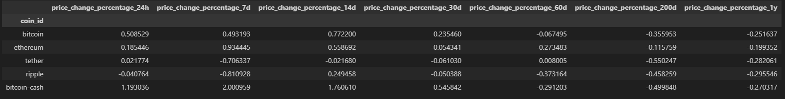
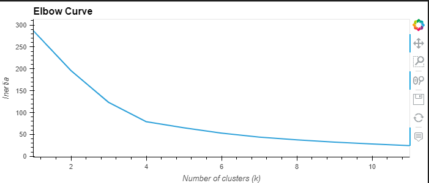
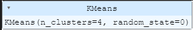
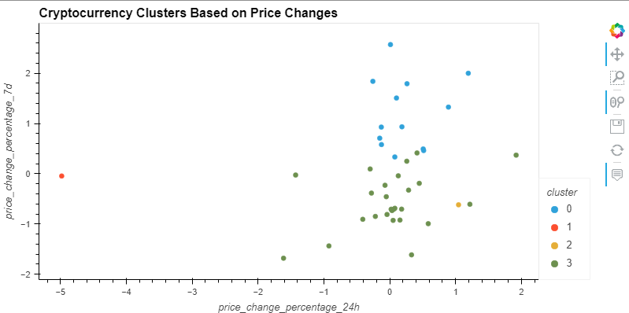
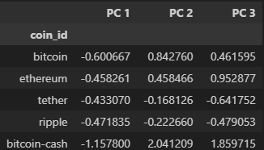
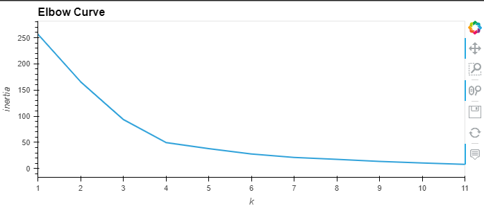
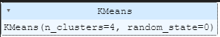
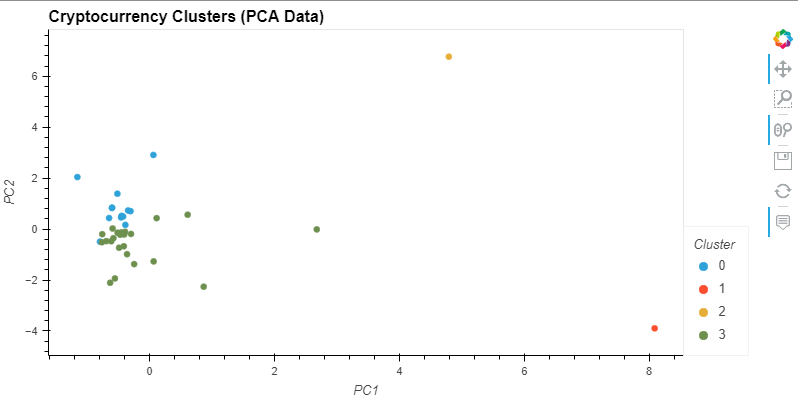
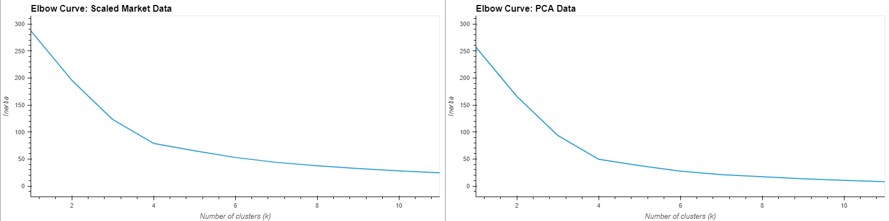
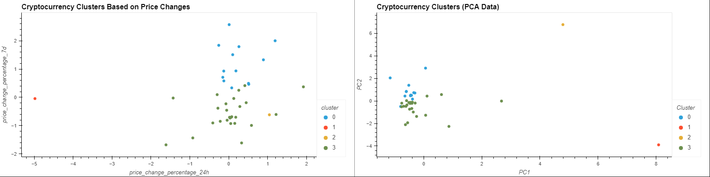

# CryptoClustering

Using K-means and Principal Component Analysis (PCA), this script performs clustering anaylsis on cryptocurrency market data (crypto_market_data.csv) in an effort to predict if cryptocurrencies are affected by 24 hour or 7 day price changes.

### Dependencies

* pandas
* hvplot
* sklearn.cluster.Kmeans
* sklearn.decomposition.PCA
* sklearn.preprocessing.StandardScaler

### Initial Market Data:

Below is an overview of our original data.

### **Prepare the Data**

Using StandardScaler()) module, the data is normalized and a DataFrame is created with the scaled data.

### Find the Best Value for k Using the Original Data.

Creating a list of k-values 1-11 and an empty list to store the inertia values, a loop then computes the inertia for each possible value. The inertia values are appended to the inertia list. Using the k-values and inertia values from the lists, a new DataFrame referencing the scaled data is created to plot the Elbow curve to help identify the optimal value for k.

* **Question:** What is the best value for `k`?
  Answer: k4

### Cluster Cryptocurrencies with K-means Using the Original Scaled Data

Initizalizing a k-means model with 4 clusters and fitting it to the original scaled DataFrame, we then predict clusters to group the cryptocurrencies and add a new column to hold the predicted clusters. A scatterplot is then created to display the clustered scatter plot, with more information on the columns when hovering over each data point.

### Optimize Clusters with Principal Component Analysis

Performing a PCA and reducing the features to three principal components transforming the scaled data using fit.transform. The explained variance is then calculated to understand the amount of information attributed to each principal component, and the total explained variance is computed as well.

* **Question:** What is the total explained variance of the three principal components?
  Answer: The total explained variance is 89.5% of the total variance in the dataset.

### Find the Best Value for k Using the PCA Data

Creating a list of k-values 1-11 and an empty list to store the inertia values, a loop then computes the inertia for each possible value. The inertia values are appended to the inertia list. Using the k-values and inertia values from the lists, a new DataFrame referencing the PCA Data is created to plot the Elbow curve to help identify the optimal value for k.

* **Question:** What is the best value for `k` when using the PCA data?
  Answer: k4
* **Question:** Does it differ from the best k value found using the original data?
  Answer: No

### Cluster Cryptocurrencies with K-means Using the PCA Data

Initizalizing a k-means model with 4 clusters and fitting it to the PCA DataFrame, we then predict clusters to group the cryptocurrencies and add a new column to hold the predicted clusters. A scatterplot is then created to display the clustered scatter plot, with more information on the columns when hovering over each data point.

### Visualize and Compare the Results

Composite plots to contrast the elbow plots and cluster scatter plots are created to compare the results.

**Question:** After visually analyzing the cluster analysis results, what is the impact of using fewer features to cluster the data using K-Means?

Answer: It's easier to interpret and understand, though some features (potentially very relevant) are lost and it's less computationally expensive.
